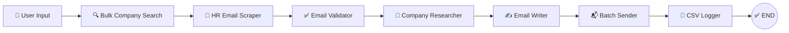

<p align="center">
  <h1 align="center">🤖 Bulk AI Job Outreach Bot</h1>
  <p align="center">
    <strong>AI-powered bulk job application system that finds companies, personalizes emails, and sends them automatically.</strong>
  </p>
  <p align="center">
    One command. 100–300 companies. Full automation.
  </p>
</p>

<p align="center">
  
  
  
  
  
  
</p>

---

## 📋 Table of Contents

- [Overview](#-overview)
- [Key Features](#-key-features)
- [Architecture](#-architecture)
- [Tech Stack](#-tech-stack)
- [Project Structure](#-project-structure)
- [Prerequisites](#-prerequisites)
- [Installation — Local](#-installation--local)
- [Installation — Docker](#-installation--docker)
- [Environment Setup](#-environment-setup)
- [Usage](#-usage)
- [Output Files](#-output-files)
- [Configuration](#-configuration)
- [Safety & Rate Limiting](#-safety--rate-limiting)
- [Troubleshooting](#-troubleshooting)
- [Roadmap](#-roadmap)
- [Contributing](#-contributing)
- [Disclaimer](#%EF%B8%8F-disclaimer)
- [License](#-license)

---

## 🔍 Overview

**Bulk AI Job Outreach Bot** is a fully automated pipeline that searches for companies hiring for your target role, discovers HR/careers email addresses, generates personalized outreach emails using Mistral AI, and sends them in Gmail-safe batches — all in a single execution.

Built with **LangChain** for AI orchestration, **LangGraph** for stateful pipeline management, and **Mistral AI** for intelligent email personalization.

### How It Works

```
python main.py
```

1. You enter a **job role** (e.g., "Data Analyst") and optional **location**
2. The bot searches the web for **100–300 companies** hiring for that role
3. It scrapes and validates **HR/careers email addresses** for each company
4. **Mistral AI** researches each company and writes a **personalized email**
5. Emails are sent in **configurable batches** with your resume attached
6. Everything is logged to **CSV files** for full traceability

---

## ✨ Key Features

| Feature | Description |
|---------|-------------|
| 🔍 **Bulk Company Discovery** | Finds 100–300 companies in one run via 30+ diverse search queries |
| 📧 **Smart Email Scraping** | Scrapes websites, searches the web, generates common HR patterns |
| ✅ **DNS Email Validation** | Verifies MX records, deduplicates across all companies |
| 🔬 **AI Company Research** | Mistral AI generates brief research summaries per company |
| ✍️ **Personalized Emails** | Each email is unique, company-specific, and spam-filter-safe |
| 📎 **Resume Attachment** | Automatically attaches your PDF resume to every email |
| 📬 **Batch Sending** | Configurable batch sizes with randomized delays |
| 🛡️ **Gmail Safety** | Respects daily quotas, retries failures, stops on quota exceeded |
| 📊 **Full CSV Logging** | Tracks every sent email, failed attempt, and discovered company |
| 🐳 **Docker Support** | One-command deployment with `docker-compose up --build` |

---

## 🏗️ Architecture

The pipeline is orchestrated by **LangGraph** as a linear state machine with 7 nodes:



### Pipeline Flow Detail

```
┌─────────────────────────────────────────────────────────────┐
│                    LANGGRAPH STATE MACHINE                   │
├─────────────────────────────────────────────────────────────┤
│                                                             │
│  1. bulk_company_search   → 30+ Tavily queries             │
│     Discovers 100-300 companies from web search             │
│                         ↓                                   │
│  2. hr_email_scraper      → Website scraping + patterns     │
│     Finds careers@, hr@, jobs@ for each company             │
│                         ↓                                   │
│  3. email_validator       → Format + DNS MX + dedup         │
│     Validates every email, removes invalid/duplicate        │
│                         ↓                                   │
│  4. company_researcher    → Mistral AI research             │
│     Generates 2-3 sentence company summaries                │
│                         ↓                                   │
│  5. personalized_email_writer → Mistral AI generation       │
│     Creates unique subject + body for each company          │
│                         ↓                                   │
│  6. batch_bulk_sender     → Gmail SMTP with retries         │
│     Sends in batches with resume, respects quotas           │
│                         ↓                                   │
│  7. csv_logger            → CSV export + activity log       │
│     Saves sent_log, failed_log, companies_found             │
│                                                             │
└─────────────────────────────────────────────────────────────┘
```

---

## 🛠️ Tech Stack

| Layer | Technology |
|-------|-----------|
| **AI Framework** | LangChain + LangGraph |
| **LLM** | Mistral AI (`mistral-large-latest`) |
| **Web Search** | Tavily Search API |
| **Web Scraping** | BeautifulSoup4 + lxml |
| **Email Sending** | Gmail SMTP (SSL) |
| **Email Validation** | dnspython (MX record lookup) |
| **Data** | Pandas + CSV |
| **Configuration** | python-dotenv |
| **Containerization** | Docker + Docker Compose |
| **Language** | Python 3.11+ |

---

## 📁 Project Structure

```
bulk-ai-job-outreach/
│
├── main.py                      # Entry point — run this
├── config.py                    # Centralized configuration & validation
├── graph.py                     # LangGraph pipeline definition (7 nodes)
│
├── bulk_company_search.py       # Node 1: Tavily-powered company discovery
├── hr_email_scraper.py          # Node 2: Multi-strategy email finder
├── email_validator.py           # Node 3: DNS MX validation + dedup
├── company_researcher.py        # Node 4: Mistral AI company research
├── personalized_email_writer.py # Node 5: Mistral AI email generation
├── batch_bulk_sender.py         # Node 6: Gmail SMTP batch sender
├── resume_handler.py            # Resume PDF loading & attachment
├── csv_logger.py                # Node 7: CSV + activity logging
│
├── resume/                      # Place your resume PDF here
│   └── README.txt               # Instructions for resume placement
│
├── output/                      # Auto-generated at runtime
│   ├── sent_log.csv             # Successfully sent emails
│   ├── failed_log.csv           # Failed/skipped emails
│   ├── companies_found.csv      # All discovered companies
│   └── activity_log.txt         # Timestamped activity log
│
├── Dockerfile                   # Python 3.11-slim container
├── docker-compose.yml           # One-command Docker deployment
├── .dockerignore                # Docker build exclusions
│
├── requirements.txt             # Python dependencies
├── .env.example                 # Environment variable template
├── .gitignore                   # Git exclusions
├── CONTRIBUTING.md              # Contribution guidelines
├── LICENSE                      # MIT License
└── README.md                    # This file
```

---

## 📦 Prerequisites

- **Python 3.11+** (for local) or **Docker** (for containerized)
- **Mistral AI API Key** — [Get one free](https://console.mistral.ai/)
- **Tavily API Key** — [Get one free](https://tavily.com/) (1,000 searches/month)
- **Gmail Account** with App Password enabled

---

## 🖥️ Installation — Local

```bash
# 1. Clone the repository
git clone https://github.com/YOUR_USERNAME/bulk-ai-job-outreach.git
cd bulk-ai-job-outreach

# 2. Create a virtual environment (recommended)
python -m venv venv
source venv/bin/activate        # Linux/Mac
venv\Scripts\activate           # Windows

# 3. Install dependencies
pip install -r requirements.txt

# 4. Set up environment
cp .env.example .env            # Linux/Mac
copy .env.example .env          # Windows

# 5. Edit .env with your API keys (see Environment Setup below)

# 6. Place your resume PDF
#    Copy your resume to the project directory or set RESUME_PATH in .env

# 7. Run
python main.py
```

---

## 🐳 Installation — Docker

```bash
# 1. Clone the repository
git clone https://github.com/YOUR_USERNAME/bulk-ai-job-outreach.git
cd bulk-ai-job-outreach

# 2. Set up environment
cp .env.example .env            # Linux/Mac
copy .env.example .env          # Windows
# Edit .env with your API keys

# 3. Place your resume
#    Drop your resume.pdf into the ./resume/ folder
#    Set RESUME_PATH=/app/resume/resume.pdf in .env

# 4. Run
docker-compose up --build
```

### Docker Commands

| Action | Command |
|--------|---------|
| Build & Run | `docker-compose up --build` |
| Detached Mode | `docker-compose up --build -d` |
| Attach to Container | `docker attach bulk_outreach_bot` |
| View Logs | `docker-compose logs -f ai_job_bot` |
| Stop | `docker-compose down` |
| Rebuild (no cache) | `docker-compose build --no-cache` |

---

## ⚙️ Environment Setup

### 1. Create `.env` File

```bash
copy .env.example .env    # Windows
cp .env.example .env      # Linux/Mac
```

### 2. Required Variables

```env
MISTRAL_API_KEY=your_mistral_api_key_here
GMAIL_EMAIL=your.email@gmail.com
GMAIL_APP_PASSWORD=your_16_char_app_password
RESUME_PATH=/app/resume/resume.pdf        # Docker
# RESUME_PATH=C:/Users/You/resume.pdf     # Local
TAVILY_API_KEY=your_tavily_api_key_here
```

### 3. Get a Mistral AI API Key

1. Go to [console.mistral.ai](https://console.mistral.ai/)
2. Sign up / Log in
3. Navigate to **API Keys**
4. Create a new key and copy it

### 4. Get a Tavily API Key

1. Go to [tavily.com](https://tavily.com/)
2. Sign up (free tier = 1,000 searches/month)
3. Copy your API key from the dashboard

### 5. Gmail App Password Setup

> ⚠️ **You cannot use your regular Gmail password.** You need an App Password.

1. Go to [myaccount.google.com](https://myaccount.google.com)
2. Click **Security** in the left sidebar
3. Enable **2-Step Verification** (if not already enabled)
4. Go back to Security → find **App passwords**
5. Select **Mail** and **Windows** (or your OS)
6. Click **Generate**
7. Copy the 16-character password (e.g., `abcd efgh ijkl mnop`)
8. Paste it into `.env` as `GMAIL_APP_PASSWORD` (remove spaces)

---

## 🚀 Usage

### Run Locally

```bash
python main.py
```

### Run with Docker

```bash
docker-compose up --build
```

### Interactive Prompts

```
============================================================
   🤖 BULK AI JOB OUTREACH BOT
   Powered by LangChain + LangGraph + Mistral AI
============================================================

📋 SETUP
   Enter target job role (e.g., Data Analyst): Data Analyst
   Enter preferred location (press Enter for any): New York

   ✅ Role: Data Analyst
   ✅ Location: New York

   🚀 Start bulk outreach? (y/n): y
```

The bot then runs the full 7-step pipeline automatically.

---

## 📊 Output Files

All output is saved to the `output/` directory:

### `sent_log.csv`

```csv
timestamp,company_name,domain,email,subject,status
2026-05-16 10:30:45,Acme Corp,acme.com,careers@acme.com,Application for Data Analyst - Acme Corp,SENT
2026-05-16 10:32:12,TechFlow,techflow.io,hr@techflow.io,Data Analyst Opportunity at TechFlow,SENT
```

### `failed_log.csv`

```csv
timestamp,company_name,domain,email,status,error
2026-05-16 10:35:00,BadDomain Inc,baddomain.xyz,hr@baddomain.xyz,FAILED,Send failed after retries
```

### `companies_found.csv`

```csv
company_name,domain,website,primary_email,all_emails,research_snippet
Acme Corp,acme.com,https://acme.com,careers@acme.com,"careers@acme.com; hr@acme.com",Technology company...
```

### `activity_log.txt`

```
[2026-05-16 10:25:00] NEW OUTREACH SESSION STARTED
[2026-05-16 10:25:00] Role: Data Analyst
[2026-05-16 10:25:00] Location: New York
[2026-05-16 11:45:00] SENDING COMPLETE - Sent: 142, Failed: 8
```

---

## 🔧 Configuration

Optional settings via `.env`:

| Variable | Default | Description |
|----------|---------|-------------|
| `BATCH_SIZE` | `50` | Companies processed per sending batch |
| `MIN_DELAY_BETWEEN_EMAILS` | `30` | Minimum seconds between sends |
| `MAX_DELAY_BETWEEN_EMAILS` | `120` | Maximum seconds between sends |
| `BATCH_DELAY_MINUTES` | `10` | Minutes pause between batches |
| `TARGET_COMPANY_COUNT` | `150` | Number of companies to discover |

---

## 🛡️ Safety & Rate Limiting

| Feature | Implementation |
|---------|----------------|
| **Randomized delays** | 30–120 second random wait between emails |
| **Batch pauses** | Configurable pause between batches (default 10 min) |
| **Gmail quota detection** | Automatically stops when daily limit (500) is hit |
| **Retry logic** | Failed sends retried up to 3 times |
| **Duplicate prevention** | Each email address receives only one message |
| **DNS validation** | MX record verification skips undeliverable domains |
| **Error isolation** | Individual failures don't crash the pipeline |

---

## 🔧 Troubleshooting

| Issue | Solution |
|-------|----------|
| `SMTP authentication failed` | Use a Gmail **App Password**, not your regular password |
| `Resume not found` | Check `RESUME_PATH` in `.env` — use `/app/resume/file.pdf` for Docker |
| `Tavily API error` | Verify your key at [tavily.com](https://tavily.com/) |
| `Mistral API error` | Verify your key at [console.mistral.ai](https://console.mistral.ai/) |
| `No companies found` | Try a broader job title or remove the location filter |
| `Gmail quota exceeded` | Wait 24 hours — Gmail resets its daily limit automatically |
| `Docker: can't type input` | Don't use `-d` flag, or run `docker attach bulk_outreach_bot` |
| `Docker: env file not found` | Run `copy .env.example .env` and fill in your values |

---

## 🗺️ Roadmap

- [ ] Multi-provider LLM support (OpenAI, Anthropic, Gemini)
- [ ] LinkedIn profile scraping integration
- [ ] Email open/reply tracking
- [ ] Follow-up email automation
- [ ] Resume customization per company
- [ ] Web dashboard for monitoring
- [ ] Proxy/rotation support for scraping
- [ ] Database storage (SQLite) for historical data
- [ ] Scheduled runs via cron/Task Scheduler

---

## 🤝 Contributing

Contributions are welcome! Please read the [Contributing Guide](CONTRIBUTING.md) for details on the process and code of conduct.

---

## ⚖️ Disclaimer

> **This tool is provided for educational and personal use only.**
>
> - **Respect anti-spam laws** (CAN-SPAM, GDPR, etc.) in your jurisdiction.
> - **Do not use this tool for unsolicited mass spam.** It is designed for genuine job-seeking outreach.
> - **You are solely responsible** for how you use this tool and the emails you send.
> - **Respect rate limits** of all APIs and email providers.
> - **Never share API keys or credentials.** Keep your `.env` file private.
> - **Resume privacy:** Your resume contains personal information. Never commit it to version control.
>
> The authors are not responsible for any misuse, account suspensions, or legal consequences arising from the use of this software.

---

## 📄 License

This project is licensed under the MIT License — see the [LICENSE](LICENSE) file for details.

---

<p align="center">
  <strong>Built with ❤️ using LangChain + LangGraph + Mistral AI</strong>
  <br>
  <sub>If this project helped you, consider giving it a ⭐</sub>
</p>
